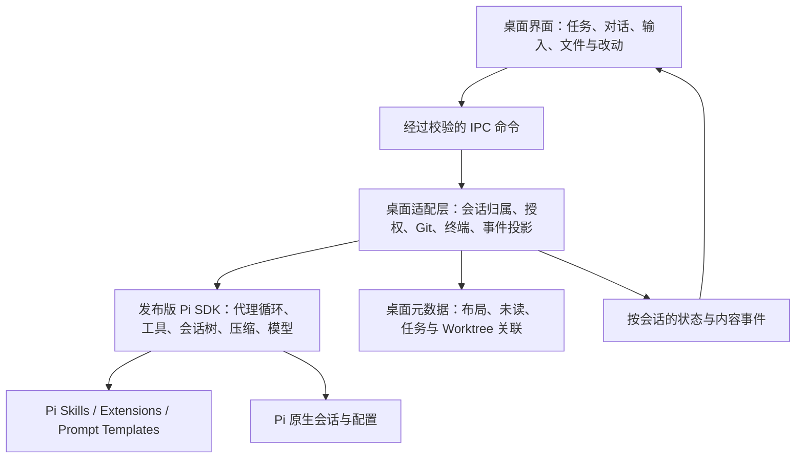

# Pi Desktop 优化方案

日期：2026-09-28。分析基线：`0.1.17`，当前 HEAD `1bf2318df`，Pi SDK 固定版本 `0.87.1`。

## 第一轮实施记录（2026-09-28）

已在原有 Electron / Pi SDK 架构内完成以下改动，依赖与 Pi 版本保持不变：

| 范围 | 当前行为 |
| --- | --- |
| 输入提交 | 复用 SDK `preflightResult`，区分“已接受”与“执行结束”；已接受即释放输入框，预检失败保留草稿与附件，后续执行错误归属原任务。每次提交携带 sessionId / requestId；requestId 用于关联回执，并非持久化幂等保证。 |
| 运行中补充 | Enter 为立即引导，Option/Alt+Enter 为排队跟进，同时提供可见按钮；仍遵循 Pi 的工具执行边界与队列语义。运行中的图片输入暂不支持，会保留并提示。 |
| 队列与停止 | 操作明确指定原会话；取回内容来自 Pi 实际清除的队列，避免复制已经被处理的旧快照。异步回执不会清空另一任务的草稿。 |
| 快捷键 | ⌘/Ctrl+K 搜索、⌘/Ctrl+L 聚焦输入、⌘/Ctrl+N 新任务、⌘/Ctrl+J 终端；输入法候选、弹窗和终端拥有各自作用域。 |
| 审批 | 请求显示任务、项目路径及到期倒计时；可定位任务。权限模式按驻留会话保存，调整一项不会放行其他会话的请求；应用重启或重新创建运行时会话后回到逐次询问。 |
| Git / Diff | 文件变更和当前任务结束触发刷新；Diff 区分加载失败与无改动，失败可重试；丢弃过期响应，拆开目录加载和预览读取的请求编号。普通文件夹正常返回空的 Git/Worktree 列表，其他查询错误仍可见。 |
| 完成提示 | 完成状态比较绑定 sessionId，避免从运行 A 切换到空闲 B 时误提示 B 完成。通知点击定位留在下一轮。 |
| macOS 图标 | 新增 `build/icon-mac.svg` / `build/icon-mac.png`：纯白圆角底、深灰 π；macOS 打包配置及开发版 Dock 使用此图标，修正运行时资源路径并检查打包包含图标资源。 |

验证结果：

- `npm run check` 通过：Biome、主进程与 Renderer 构建、构建产物校验、主进程/Renderer TypeScript 检查。
- 定向运行 8 个测试文件，共 56 项通过：提交接受/完成分离、后台失败归属、预检期间重复提交、元数据失败不撤回接收、审批隔离与超时、输入法/快捷键、IPC 契约、Git 与普通文件夹、输入控件和双语资源。
- 测试使用 SDK 边界替身，没有调用收费模型；不等同于真实网络、模型或完整桌面端到端验收。
- 已生成并目视检查 PNG 图标。当前 Computer Use 权限不可用，尚未做真实窗口点击、窄窗口布局或 Dock 截图验证；macOS 安装包尚未构建，已验证其配置和图标资源。
- 已用最终构建重启开发版，确认 Electron 主进程及 Renderer 进程持续运行；重启后的启动日志未再出现普通目录的 Git 查询错误。已安装的 `pi-subagents` 扩展仍输出动态工具支持的探测提示，本轮未修改该扩展。

后续继续按阶段 2 / 3 推进流式事件与会话索引性能、通知定位/恢复、改动审阅闭环。本文下方“关键发现”的行号和旧行为均指初始分析基线，用于解释本轮改动来源。

## 结论与目标

建议产品定位为：**用 Codex 式桌面工作流承载 Pi 的精简代理内核。**

当前项目已有相当完整的能力，下一阶段的主要投入应是把「发送任务 → 执行中补充 → 查看改动 → 反馈修改 → 切换任务」做顺，而不是继续扩大功能清单。

“精简”分为三层：

- 内核精简：继续直接使用已发布的 Pi SDK，复用它的代理循环、会话树、压缩、模型和扩展机制。
- 界面精简：主界面优先呈现当前任务、输入框、执行状态和产物；模型高级设置、统计和扩展管理按需展开。
- 运行精简：避免每次流式事件重算完整历史；限制闲置会话占用；重型内容按需渲染。

桌面体验可以优化操作成本、反馈速度和可控性；代理完成任务的质量仍受所选模型、上下文和工具影响，不能仅通过界面达到与 Codex 相同的模型表现。

## 初次分析时的运行记录与证据边界

- 已在当前仓库执行 `npm run start`；该脚本自带主进程与 Renderer 生产构建，构建成功，随后启动 Electron。
- 已检查到 Electron 主进程及 Renderer 子进程持续运行，保持应用运行供用户查看。
- 当前环境未授予 Computer Use 权限，无法读取桌面窗口、截图或完成点击走查。本方案的交互问题来自调用链分析，并未声称通过真实点击复现。
- 初次分析阶段未调用模型、修改账户配置或发送项目内容到模型服务；当时未改业务代码、依赖或测试，未提交代码。
- 初次分析阶段未执行 `npm run check` 或测试套件；后续实施结果见上方“第一轮实施记录”。启动成功不等于完整检查或全部功能通过。
- 下述性能问题属于代码结构可见的风险，尚无长会话、多模型并发或冷启动的正式测量结果。

## 已有基础：继续复用

| 范围 | 当前已有能力 | 下一步重点 |
| --- | --- | --- |
| Pi 内核 | `createAgentSession`、`SessionManager`、`DefaultResourceLoader`；受信任项目默认使用 read/bash/edit/write | 保持版本固定和单一运行时，补齐桌面适配 |
| 会话与项目 | 多会话驻留、跨项目切换、置顶/归档/分组、搜索、分支/Fork | 状态正确、并发隔离、通知可定位 |
| 输入 | 图片、文件引用、会话引用、草稿恢复、历史、斜杠命令、中文输入法处理 | 接通运行中引导/排队，统一快捷键 |
| 执行展示 | 流式文本、工具记录、过程折叠、代码高亮、Markdown、公式、图表 | 当前动作可见、结束结果突出、增量渲染 |
| 工作区 | 文件树、多格式预览、源码行引用、Diff、终端、Worktree | Git 自动刷新、任务与改动联动 |
| 稳定性基础 | 信任检查、IPC 校验、Renderer 隔离与 sandbox、认证/审批队列、审计日志 | 保留这些边界，提高多任务语义和可恢复性 |

已存在的性能措施包括 React memo、聊天记录初始显示 40 个分组并逐步加载、目录按需加载、文件搜索防抖与构建分包。后续应在这些基础上优化，不能把它们描述成尚未实现。

## 关键发现及优先级

### P0：运行中无法正常补充指令

调用链为：`App.handleSubmit → submitPrompt → IPC prompt → DesktopAgentHost.prompt → Pi session.prompt`。

- `app.tsx:3792` 等待 `submitPrompt` 完成后才清空草稿。
- `desktop-agent-host.ts:1140` 等待 Pi 的完整 prompt 生命周期。
- `app.tsx:6230` 附近的 textarea 在 `submitting` 时禁用。
- `app.tsx:3788` 在 running 时直接返回，唯一的 `submitPrompt` 调用也未传入 `steer` / `followUp`。
- Store、IPC 和 Host 已有 `streamingBehavior` 支持，界面也已有排队消息展示；断点集中在桌面输入提交链路。

**改法：**

1. 将「输入已接受」和「这一轮已完成」分开。当前安装的 SDK `PromptOptions` 已提供 `preflightResult`，优先评估复用；前置校验成功后确认接收，后续执行通过事件更新。
2. 提交命令携带 `sessionId`、`requestId`；不要让异步结果依赖“此刻选中的会话”。异步异常必须被捕获并回传。
3. 接收成功即清空本次输入并开放编辑；接收失败保留草稿和附件，提供重试。模型执行失败显示为该任务的失败状态。
4. 运行中提供「立即引导」与「排队跟进」两个明确动作，直接映射 Pi 原有语义；“立即”仍受 Pi 的工具执行边界约束。
5. 第一版复用 Pi 的队列与整体取回能力；逐条编辑、删除和重排需先核对 SDK 能力，避免桌面另造一套互相不同步的执行队列。

**验收：**开始一个持续 30 秒的任务后，能继续输入、引导和排队；切换到另一个项目不会清空其草稿；失败时输入可恢复；停止后状态一致。

### P0：快捷键与输入法行为需要统一

`app.tsx:3146` 附近的全局监听用 `⌘/Ctrl+K` 聚焦输入框，`app.tsx:3211` 附近的另一个监听同时用它切换搜索。一次按键会触发两个职责。

已有中文 composition 标记，但建议检查完整事件顺序：历史/建议菜单的 Enter 分支出现在最终发送的 composition 判断之前，候选词确认时应优先保护输入法。

**改法：**做一个轻量命令注册表，统一动作 ID、快捷键、菜单名称和作用范围。推荐 `⌘K` 搜索/命令入口，`⌘L` 聚焦输入，`⌘N` 新任务，`⌘J` 终端；运行中引导/跟进展示快捷键提示。快捷键约定属于建议，实施前结合当前用户习惯确定。

**验收：**每个组合键只有一个动作；打开弹窗、选中终端、中文候选词确认时不会误发送或误停止。

### P0：Git 信息可能滞后，Diff 失败会显示成空内容

实际主界面入口是 `app.tsx` 内的 `WorkspaceExplorer` 与 `Inspector`：

- Git 列表的 effect（约 `1761` 行）只跟随工作区与信任状态更新，未依赖已有的文件刷新信号。
- `Inspector` 的 Diff 加载（约 `2149` 行）跟随路径和模式变化，同一路径内容更新不会自动触发。
- `loadDiff` 捕获错误后设置空字符串，容易把加载失败呈现为没有差异。
- `git-integration.ts:54` 使用 `git diff HEAD`，当前视角合并暂存与未暂存修改，没有独立的 review scope。

仓库另有 `source-control.tsx`，但当前 Renderer 入口没有引用它；优化应修改实际使用的界面，避免维护第二套未接入面板。

**改法：**按工作区维护一个 Git 状态源；文件变更、Git 操作完成和任务结束触发防抖刷新。Diff 使用工作区、路径、范围、版本号作为请求标识，丢弃过期响应，明确区分加载中、无变化、失败、二进制文件。

**验收：**代理或用户修改文件后约 1 秒内列表与当前 Diff 同步；连续切换文件不会显示上一个文件的晚到结果。

### P0：多任务审批缺少明确的归属信息

- Host 有多会话管理，但 `DesktopToolApproval`（`contracts.ts:88`）没有 `sessionId`、项目路径等展示信息。
- `getSnapshot` 返回整个审批队列，主界面统一显示工具名与原始 JSON。
- 队列默认 120 秒未响应即拒绝（`tool-approval-queue.ts:28`）；界面没有对应的超时解释。
- `permissionMode` 是 Host 级全局状态；调整模式会放行所有符合条件的待批工具调用。

这是当前多任务产品语义的不足，不应直接定性为已发生跨项目越权。

**改法：**审批显示所属项目/任务、命令或路径、工作目录和影响摘要；保留完整参数展开。按会话呈现“等待批准”，点击能定位任务。保留逐工具决策与现有超时拒绝行为，补上到期提示和失败原因。将权限策略作用范围明确化，优先支持会话级策略；若保留全局选项，应清晰展示其全局含义。

**验收：**A 项目后台等待审批、用户查看 B 项目时，能准确识别并处理 A 的请求；B 的策略调整不会隐式改变 A 的策略。

### P1：流式更新携带过多无关数据

`desktop-agent-host.ts:1063` 附近的 SDK 事件订阅对每个事件调用 `publish()`；`getSnapshot():591` 重新整理完整消息、模型列表、Skills/Plugins、统计和整个分支树。后台会话的事件也会触发当前会话快照发布。

Renderer 通过整个 Snapshot 订阅（`app.tsx:2515`），会再次计算消息分组、导航、时间戳等。已有 memo 与分组分页能减少部分渲染，但不能消除全量 IPC 传输和数组重建；一个折叠过程分组仍可能包含大量工具节点。

**改法分两步：**

1. 低风险优化：缓存不变的配置/历史对象、合并流式刷新、重计算只作用于活动尾部；折叠工具详情在展开时挂载；分支树与统计按变化或面板需要更新。
2. 用测量决定是否升级为 `bootstrap snapshot + session deltas`。事件带 `sessionId / sequence / revision`，前台只订阅活动内容，后台只更新摘要；丢失序号时重新拉取快照。开始、停止、失败、审批立即送达，文本可按 16–50 ms 窗口合并。

`session-index.ts` 目前每次列出全部会话目录，`refreshSessions` 又重新解析项目 Git 元数据。先做内存增量索引与有限缓存，再根据规模决定是否需要持久索引，不先引入额外数据库。

### P1：任务状态、通知与恢复需要以会话为单位

后台完成提示和未读标记已经存在（`app.tsx:3320` 附近），但仍有补齐点：

- `DesktopSessionPhase` 主要为 idle/running/error/unavailable，无法直接表达等待审批、压缩、重试和用户停止。
- 当前会话的完成检测使用单个 `previousPhaseRef`，没有绑定 sessionId；从运行中的 A 切到空闲 B 存在误判完成的代码路径。
- `main.ts:917` 的通知只展示文案，没有点击跳回对应任务的处理。
- 状态判定主要在 Renderer；未发现 `render-process-gone` / `did-fail-load` 恢复处理。
- 驻留会话有 `lastUsedAt`，目前未见基于闲置时间或容量的回收策略。

**改法：**Host 维护会话级状态和完成事件，UI 只展示；任务生命周期与等待原因分开建模，避免把所有组合硬编码为巨型状态枚举。通知去重并携带会话定位。Renderer 重载后用快照恢复；整进程退出后将未完成任务标记为中断，恢复原会话并由用户明确继续，不自动重放可能已执行的写文件/命令。

只回收空闲且无待处理审批/扩展交互的会话，活动任务始终驻留；重开会话继续使用 Pi 的持久化格式。

### P1：将 Diff 变成反馈闭环

目前可以查看 Diff，也有源码行引用，这些是可复用基础。建议按以下顺序完善：

1. 任务结束卡片直接显示“改了哪些文件、测试结果、查看改动”。测试结果来自实际命令与退出码，无法确定时显示未验证。
2. 右侧统一工作面板支持“工作区改动 / 已暂存 / 未暂存 / 分支比较”，以后再加入“本轮变化”。
3. 点选 Diff 行附上反馈，形成结构化文件路径与行号引用并送回当前输入框。
4. 文件级暂存、撤销作为后续独立操作；撤销前检查版本并展示影响，不把它混入模型生成动作。

“本轮变化”不能等同于 `git diff HEAD`。需要轮次开始的工作区基线；已有用户修改与同期外部修改不能一概归因于代理。同一目录多个写任务还会交叉污染差异，优先引导独立 Worktree，或限制同一工作区并行写入。

### P2：界面一致性与维护成本

当前 `app.tsx` 约 6,901 行、`desktop-agent-host.ts` 约 2,725 行、`styles.css` 约 11,646 行。行数本身不是性能结论，但输入、文件、任务、设置等职责集中，会让修改互相牵连。

建议随功能修改逐步拆出：

- Renderer：`AppShell`、`ProjectSidebar`、`ConversationView`、`Composer`、`WorkspacePanel`、`CommandRegistry`。
- Main：保留 `DesktopAgentHost` 作为薄门面，逐步提取 `SessionRegistry`、`SessionProjection`、`ApprovalService`、`GitService` 和配置服务。
- 样式：统一间距、颜色、字号、按钮和弹窗规范，按模块整理，清除实际未使用的旧样式。

模型与扩展配置分为常用项和高级项；首次使用按“选择项目 → 配置模型 → 开始任务”组织。保留已经实现的主题、焦点样式、减少动画偏好和窄窗口处理，再通过真实 UI 走查确定需要改动的视觉细节。

Pi 扩展 UI 当前有部分 no-op 适配，如 `getEditorText()` 返回空串、自动补全注册不生效；建议建立“完整支持 / 部分支持 / 不支持”的能力表，并向扩展提供可见诊断，避免静默失败。优先保留 TUI/桌面共用扩展，不另建不兼容的插件体系。

## 推荐的架构边界

坚持以下边界：

- 保留默认四种核心工具与 Pi 原生模型接入，不维护 Pi fork，不改成本地源码依赖。
- 会话正文与分支以 Pi SessionManager 为真源；桌面只保存视图与任务关联元数据。若要与 TUI 同时打开同一会话文件，必须验证单写入者约束。
- IPC、工作区信任、逐工具审批、认证队列、审计继续保留。Electron Renderer sandbox 与代理运行命令的 OS 隔离不是同一件事，不能互相替代。
- 第一阶段继续使用现有进程结构。只有性能测量表明主进程被 SDK/扩展阻塞时，再考虑把 Pi SDK 移入受控 utility/child process；权限仍由桌面可信层管理，沿用可校验协议，不额外启动一个对外监听的 HTTP 服务。
- 自动化、多代理、MCP、大型记忆/RAG、远程协作若未来有明确需求，优先通过 Pi 扩展实现，按需加载。首轮迭代不承担这些新系统。
- 不整体重写 Electron，不先嵌入完整 IDE。当前最有价值的是任务工作流和轻量改动审阅。

## 实施顺序与工作量

以下为一名熟悉 Electron/React/Pi 的开发者的粗估开发工作日，含必要回归与走查，不是承诺；视觉实测和性能基线完成后再调整。

| 阶段 | 工作 | 预计 | 交付门槛 |
| --- | --- | --- | --- |
| 0 | 补齐 UI 走查、可重复性能基线、记录核心流程 | 1–2 日 | 有启动、长会话和多任务样本，不凭感觉优化 |
| 1 | 输入接收/完成分离、引导/排队、快捷键、审批归属、Git/Diff 刷新 | 5–8 日 | 日常单任务循环顺畅，跨任务不串输入或审批 |
| 2 | 事件投影与缓存、会话级状态、通知定位、闲置回收、增量索引 | 5–8 日 | 长会话与后台任务保持可控、可恢复 |
| 3 | 改动审阅与行级反馈、统一工作面板、渐进模块拆分 | 5–8 日 | 从完成结果到定位改动、提出修正只需少量操作 |

合计约 **16–26 个开发工作日，约 4–6 周**。优先验收阶段 1 再扩展后续范围。完整的 hunk 级 Git 操作、跨进程隔离、大型扩展兼容不包含在这份首轮排期中。

建议拆分为可独立审阅的 PR：

1. `Composer` 提交生命周期与 Pi 原生引导/跟进。
2. 命令注册表与输入法/弹窗/终端快捷键作用域。
3. 审批会话标识、等待状态、策略作用域。
4. Git 数据源刷新、Diff 请求竞态与错误展示。
5. 流式事件投影、缓存和性能测量。
6. 完成事件、通知定位、恢复与闲置回收。
7. Review 面板与结构化行级反馈。

不需要先进行全仓大重构；模块拆分伴随对应 PR 进行。

## 验收与验证策略

### 功能场景

- 发送长任务后继续编辑；引导与跟进的执行时机符合 Pi 语义；发送失败保留输入。
- A 后台运行、B 前台编辑、A 请求批准、A 完成：草稿、审批、通知、未读均属于正确任务。
- 从运行 A 切到空闲 B 不触发 B 完成通知；点击 A 的通知能定位 A。
- 同一文件被外部编辑、代理编辑、连续切换文件时，Git 列表、预览、Diff 不显示陈旧或错位内容。
- 停止、网络错误、重试、压缩、Renderer 重载和应用重启都有明确结果；不自动重复执行有副作用的操作。
- Worktree 创建/切换保留明确 cwd；同目录并发写入有清晰规则；不把用户已有改动当作代理新成果。
- 中文候选确认、历史菜单和补全菜单中 Enter 行为一致；键盘可操作弹窗和主要控件。

### 性能目标（拟定，尚未测量）

统一在同一台参考机器、固定模型事件回放速度下比较，避免把网络/模型响应算成界面耗时。

| 指标 | 初始目标 |
| --- | --- |
| 点击发送后的本地反馈 | p95 < 100 ms；服务商认证/扩展预检单独显示状态与耗时 |
| 已驻留会话切换 | p95 < 200 ms |
| 1,000 条消息、3 个并发事件流下输入 | p95 按键到绘制 < 50 ms |
| Git 变更展示 | 常规修改后约 1 秒内刷新 |
| 流式长会话 | 不再让每条文本增量携带完整历史/分支树；先对比 IPC 字节与主线程耗时 |
| 连续切换 100 个历史会话 | 空闲稳定后的驻留量由回收策略限定，不随打开数量无界增长 |

以基线为准调整门槛。开发目录中 `node_modules` 约 1.4 GB、`dist` 约 7.1 MB，是磁盘观测，不等于发布安装包大小或常驻内存，不能据此决定换技术栈。

### 工程检查

实施代码后按仓库规定运行 `npm run check`；修改测试时运行相关测试文件，未经用户要求不额外启动全量 `npm test`。关键增补应覆盖提交接收与完成分离、会话切换竞态、审批隔离、Git 刷新、事件序号恢复。界面链路可通过 mock Pi 事件做集成验证，减少付费模型请求。

现有测试主要覆盖模块与契约；首轮投入应补上真实暴露问题的跨层场景，不为纯样式调整增加镜像实现的测试。

## 参考资料

- [Pi 官方介绍](https://pi.dev/)：精简内核、SDK/RPC、扩展，以及引导与跟进语义；本地具体实现另以安装的 `0.87.1` SDK 为准。
- [OpenAI：使用 Codex 执行长任务](https://developers.openai.com/blog/run-long-horizon-tasks-with-codex)：多任务、可纠偏工作流和 Worktree 的用途。
- [OpenAI 官方 Code review 文档](https://learn.chatgpt.com/docs/code-review?surface=app)：改动范围、行级反馈与审阅操作；本方案只借鉴必要的桌面工作流。

本方案对 Codex 的借鉴集中在任务可控性、可见状态和改动反馈；具体实现沿用项目现有 Pi SDK 与 Electron 架构。
